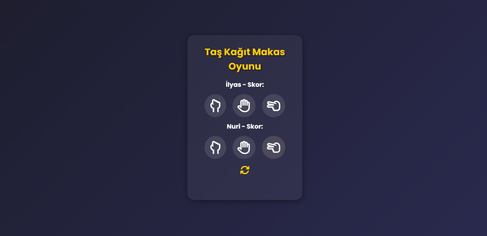
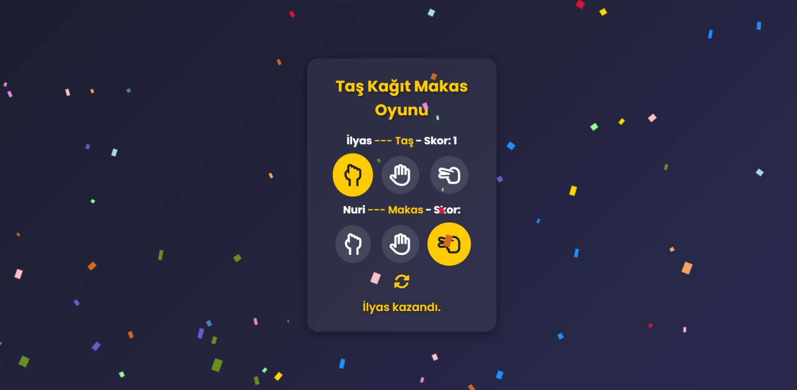

# 🎮 Taş Kağıt Makas Oyunu

Bu proje, klasik **Taş - Kağıt - Makas** oyununu modern bir arayüz ile web üzerinde oynamanı sağlar. Kullanıcı ve bilgisayar arasında oynanan bu oyunda skorlar tutulur, kazanan oyuncu ekranda duyurulur ve görsel efektlerle desteklenir. Proje, **HTML, CSS ve JavaScript** kullanılarak geliştirilmiştir.

---

## 🚀 **Özellikler**
- **Canlı skor takibi**: Kullanıcı ve bilgisayar skorları anlık olarak güncellenir.
- **Kazanan duyurusu**: Her tur sonunda kazanan ekrana yazdırılır.
- **Modern UI tasarımı**: Gradient arka plan, hover efektleri ve seçili ikon vurgusu.
- **Konfeti efekti**: Oyuncu kazandığında konfeti animasyonu çalışır.
- **Reset butonu**: Skorları ve seçilen hamleleri sıfırlayabilirsin.
- **Mobil uyumlu (responsive) tasarım**: Farklı ekran boyutlarında düzgün görünür.

---

## 🛠 **Kullanılan Teknolojiler**
- **HTML5**: Yapısal iskelet.
- **CSS3**: Modern tasarım, gradient arka planlar ve animasyonlar.
- **JavaScript (ES6)**: Oyun mantığı, skor yönetimi, DOM manipülasyonu.
- **Font Awesome**: El ikonları (Taş, Kağıt, Makas) için ikon kütüphanesi.
- **Confetti.js**: Kazanma durumunda konfeti efekti.

---

## 📂 **Proje Yapısı**
├─ index.html # Ana HTML dosyası
├─ style.css # Tasarım dosyası
├─ script.js # Oyun mantığı
├─ confetti.js # Konfeti animasyonu
└─ README.md # Proje dokümantasyonu

---

**🖼️ Ekran Görüntüsü**

